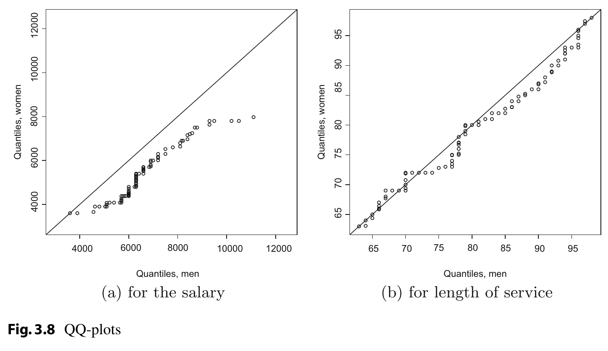

```{r setup, include=FALSE}
knitr::opts_chunk$set(echo = TRUE)
library(dplyr)
library(knitr)
```

## _Exercise 3.1_ 
A hiking enthusiast has a new app for his smartphone which summarizes his hikes by using a GPS device. Let us look at the distance hiked (in km) and maximum altitude (in m) for the last 10 hikes:

Distance | 12.5 | 29.9 | 14.8 | 18.7 | 7.6 | 16.2 | 16.5 | 27.4 | 12.1 | 17.5
--- | --- | --- | --- | --- | --- | --- | --- | --- | --- | --- 
Altitude | 342 | 1245 | 502 | 555 | 398 | 670 | 796 | 912 | 238 | 466

(a) Calculate the arithmetic mean and median for both distance and altitude.
```{r}
distance <- c(12.5, 29.9, 14.8, 18.7, 7.6, 16.2, 16.5, 27.4, 12.1, 17.5)
distance <- distance[order(distance)]
altitude <- c(342, 1245, 502, 555, 398, 670, 796, 912, 238, 466)
altitude <- altitude[order(altitude)]
data_exercise3_1 <- data.frame(distance = distance, altitude = altitude)
```
Mean and median Distance 
```{r}
summarize(data_exercise3_1, mean_distance = mean(distance), median_distance = median(distance))
```
Mean and median Altitude
```{r}
summarize(data_exercise3_1, mean_altitude = mean(altitude), median_altitude = median(altitude))
```


(b) Determine the first and third quartiles for both the distance and the altitude variables. Discuss the shape of the
distribution given the results of (a) and (b).
```{r}
#"Quartiles disntance"
quartile_distance <- quantile(data_exercise3_1$distance, probs = c(0.25, 0.75), type = 2)

#"Quartiles altitude"
quartile_altitude <- quantile(data_exercise3_1$altitude, probs = c(0.25, 0.75), type = 2)
```
```{r}
summary(data_exercise3_1)
```


(c) Calculate the interquartile range, absolute median deviation, and variance for both variables. What is your conclusion about the variability of the data?

> To calculate de variance we need to multiply the result by $(n-1)/n$, because R uses $1/(n-1)$ rather than $1/n$ when calculating the variance 

```{r}
amd <- function(x){1/length(x)*sum(abs(x-median(x)))}
# Interquartile distance
quartile_distance[[2]] - quartile_distance[[1]]
# Absolute median deviation distance 
amd(data_exercise3_1$distance)
# Variance distance
var(data_exercise3_1$distance)*9/10

# Interquartile altitude
quartile_altitude[[2]] - quartile_altitude[[1]]
# Absolute median deviation altitude
amd(data_exercise3_1$altitude)
# variance altitude
var(data_exercise3_1$altitude)*9/10
```

(d) One metre corresponds to approximately 3.28 ft. What is the average altitude when measured in feet rather than in metres?

$\bar{y} = a + b\bar{x}$

$\tilde{s}_y^2 = b^2\tilde{s}_x^2$

```{r}
# Mean 
3.28*mean(data_exercise3_1$altitude)
# Variance 
(3.28^2)*(var(data_exercise3_1$altitude)*9/10)
```
(e) Draw and interpret the box plot for both distance and altitude.
```{r}
par(mfrow = c(1, 2), mar = c(2, 5, 3, 1))
boxplot(data_exercise3_1$distance, main = "Boxplot distance", col = blues9, ylab = "Distance (km)")
boxplot(data_exercise3_1$altitude, main = "Boxplot altitude", col = blues9, ylab = "Altitude (m)")
```

(f) Assume distance is measured as only short (5–15 km), moderate (15–20 km), and long (20–30 km). Summarize the grouped data in a frequency table. Calculate the weighted arithmetic mean under the assumption that the raw data is not known. Determine the weighted median under the assumption that the values within each class are equally distributed.
```{r}
groups <- c(5, 15, 20, 30)
labels_distances <- c("1", "2", "3")
grouped_distance <- cut(distance, breaks = groups, labels = labels_distances, right = FALSE)
data_exercise3_1$groups <- grouped_distance

relative_frecuency <- as.data.frame(table(grouped_distance)/nrow(data_exercise3_1))
# get the weithted arithmetic mean 
middle_values <- groups[1:3] + (diff(groups)/2)
weighted.mean(middle_values, relative_frecuency$Freq)
```
Estimate the weighted median: 
```{r}
groups[2] + ((0.5 - relative_frecuency$Freq[1])/relative_frecuency$Freq[1])*(diff(groups)[2])
```


## _Exercise 3.2_ 
A gambler notes down his wins and losses (in euros) from playing 10 games of roulette in a casino.

Round | Won/Lost
--- | ---
1 | 200
2 | 600
3 | −200
4 | −200
5 | −200
6 | −100
7 | −100
8 | −400
9 | 0
10

(a) Assume $\bar{x}$ = − 90 euros and s = 294.7881 euros. What is the result of round 10?

$\bar{x} = \dfrac{1}{n}\sum\limits_{i=1}^nx_i$

$-90 = \dfrac{1}{10}(-400 + X)$

$X = (-90\times 10) + 400$ 

```{r}
won_lost = c(200, 600, -200, -200, -200, -100, -100, -400, 0)
data_exercise3_2 <- data.frame(round = 1:10, won_lost = c(won_lost, ((-90*10) - sum(won_lost))))
kable(data_exercise3_2)
```

(b) Determine the mode and the interquartile range.
```{r}
Modes <- function(x) {
  ux <- unique(x)
  tab <- tabulate(match(x, ux))
  ux[tab == max(tab)]
}

Modes(data_exercise3_2$won_lost)
```


(c) A different gambler plays 33 rounds of roulette. His results are $\bar{x}$ = 12 euros and s = 1000 euros. Is it meaningful to compare the variability of results of the two players by using the coefficient of variation? If yes, determine the coefficients of variation; if no, why is a comparison not possible?

It isn't possible to estimate the coefficient of variation because some of the values are negative

## Exercise 3.3
A fashion boutique has summarized its daily sales of designer socks in different groups: men’s socks, women’s socks, and children’s socks. Unfortunately, the data for men’s socks was lost. Determine the missing values.

. | n | Arithmetic mean in euros | standard deviation 
--- | --- | --- | ---
Women's wear | 45 | 16 | $\sqrt{6}$
Men's wear | ? | ? | ?
Children's wear | 20 | 7.5 | $\sqrt{3}$
total | 100 | 15 | $\sqrt{19.55}$

Men's wear $n$: 
$n_T = n_m + n_w + n_c$

$n_m = n_T - n_w - n_c$

```{r}
100 - 45 - 20
```

Men's wear $\bar{x}$: 

$\bar{x}_T = \dfrac{1}{n} \sum\limits_{j=1}^kn_jm_j$

$\bar{x}_T = \dfrac{1}{n_T}(n_w\bar{x}_w + n_c\bar{x}_c + n_m\bar{x}_m)$

$\bar{x}_m = \dfrac{1}{n_m}(n_T\bar{x}_T - n_c\bar{x}_c - n_w\bar{x}_w)$

```{r}
1/35*(100*15 - 20*7.5 - 46*16)
```

Men's wear $\tilde{s}^2$

$\tilde{s}^{2} = \dfrac{1}{n} \sum\limits^{k}_{i=1}n_{j}(\bar{x}_j - \bar{x})^{2} + \dfrac{1}{n} \sum\limits^{k}_{i=1}n_{j}\tilde{s}^2_j$

$\tilde{s}^{2}_T = \dfrac{1}{n_T} \left( n_w(\bar{x}_w - \bar{x}_T)^{2} + n_c(\bar{x}_c - \bar{x}_T)^{2} + n_m(\bar{x}_m - \bar{x}_T)^{2} \right) + \dfrac{1}{n_T} \left( n_w\tilde{s}^2_w + n_c\tilde{s}^2_c + n_m\tilde{s}^2_m \right)$

$\dfrac{1}{n_m} \left( \tilde{s}^{2}_Tn_T - n_w\tilde{s}^2_w - n_c\tilde{s}^2_c - n_w(\bar{x}_w - \bar{x}_T)^{2} - n_c(\bar{x}_c - \bar{x}_T)^{2} - n_m(\bar{x}_m - \bar{x}_T)^{2} \right)  =  \tilde{s}^2_m$

```{r}
1/35*(19.55*100 -(45*6) -(20*3) -(45*(16 - 15)**2) -(20*(7.5-15)**2) -(35*(18 - 15)**2))
```


## Exercise 3.4 
The number of members of a millionaires’ club were as follows:

Year | Members
--- | ---
2011 | 23
2012 | 24
2013 | 27
2014 | 25
2015 | 30
2016 | 28

```{r}
data_exercise3_4 <- data.frame(year = c(2011:2016), members = c(23, 24, 27, 25, 30, 28))
```


(a) What is the average growth rate of the membership?
```{r}
data_exercise3_4 <- data_exercise3_4 %>% 
    mutate(growth_factor = c(0, sapply(2:nrow(data_exercise3_4), function(i) 
        members[i]/members[i-1]))) 

(prod(data_exercise3_4$growth_factor[2:nrow(data_exercise3_4)]))**(1/5)
```

(b) Based on the results of (a), how many members would one expect in 2018?

$B_{2018} = B_{2017} \times \bar{x}_G$

$B_{2017} = B_{2016} \times \bar{x}_G$

$B_{2018} = \left( B_{2016} \times \bar{x}_G \right) \times \bar{x}_G$

$B_{2017} = B_{2016} \times \bar{x}_G^2$

```{r}
last(data_exercise3_4$members) * (1.04**2)
```


(c) The president of the club is interested in the number of members in 2025, the year when his presidency ends. Would it make sense to predict the number of members for 2025?

It could be used, but is unrealistic that the behavior of the data will be the same during all this time


In 2015, the members invested 250 euros million on the stock market. 10 members contributed 16% of the investment sum, 8 members contributed 60 euros million, 8 members contributed 70 euros million, and another 4 members contributed the remaining amount.

(d) Draw the Lorenz curve for this data.
```{r}
data2_exercise3_4 <- data.frame(members = c(0, 10, 8, 8, 4), invested = c(0, .16*250, 60, 70, 80)) %>% 
  mutate(members_freq = members / sum(members)) %>% mutate(u = cumsum(members_freq)) %>%
  mutate(invested_freq = invested/sum(invested)) %>% mutate(v = cumsum(invested_freq))

plot(data2_exercise3_4$u, data2_exercise3_4$v, xlab = "u", ylab = "v", main = "Lorenz Curve")
lines(data2_exercise3_4$u, data2_exercise3_4$v)
```


(e) Calculate and interpret the standardized Gini coefficient.
```{r}
sum_v <- sum(sapply(2:nrow(data2_exercise3_4), function(i) data2_exercise3_4$v[i] + data2_exercise3_4$v[i-1]) *
               data2_exercise3_4$members[2:nrow(data2_exercise3_4)])

# Gini coefficient
1 - (1/sum(data2_exercise3_4$members)*sum_v)
```


## Exercise 3.5 
Consider the monthly salaries Y (in Swiss francs) of a well-reputed software company, as well as the length of service (in months, X), and gender (Z). Figure 3.8 shows the QQ-plots for both Y and X given Z . Interpret both graphs.


## Exercise 3.6 
There is no built-in function in R to calculate the mode of a variable.
Program such a function yourself. Hint: type ?table and ?names to recall the
functionality of these functions. Combine them in an intelligent way.


## Exercise 3.7 
Consider a country in which 90 % of the wealth is owned by 20 % of the population, the so-called upper class. For simplicity, let us assume that the wealth is distributed equally within this class.

(a) Draw the Lorenz curve for this country.
(b) Now assume a revolution takes place in the country and all members of the upper
class have to give away their wealth which is then distributed equally across the
remaining population. Draw the Lorenz curve for this scenario.
(c) What would the curve from (b) look like if the entire upper class left the country?


## Exercise 3.8 
A bus route in the mountainous regions of Romania has a length of 418 km. The manager of the bus company serving the route wants his buses to finish a trip within 8 h. The bus travels the first 180 km with an average speed of 48 km/h, the next 117 km with an average speed of 37 km/h, and the last section with an average speed of 52 km/h.
(a) What is the average speed with which the bus travels?
(b) Will the bus finish the trip in time?


## Exercise 3.9 
Four friends have a start-up company which sells vegan ice cream.
Their initial financial contributions are as follows:

Person | Contribution (in euros)
--- | ---
1 | 800
2 | 10300
3 | 4700
4 | 2220

(a) Calculate and draw the Lorenz curve.
(b) Determine and interpret the standardized Gini coefficient.
(c) Does $G^+$ change if each of the friends contributes only half the amount of
money? If yes, how much? If no, why not?
(d) Use R to draw the above Lorenz curve and to calculate the Gini coefficient.


## Exercise 3.10 
Recall the pizza delivery data which is described in Appendix A.4.
Use R to read in and analyse the data.
(a) Calculate the mean, median, minimum, maximum, first quartile, and third quartile for all quantitative variables.
(b) Determine and interpret the 99 % quantile for delivery time and temperature.
(c) Write a function which calculates the absolute mean deviation. Use the function
to calculate the absolute mean deviation of temperature.
(d) Scale the delivery time and calculate the mean and variance for this variable.
(e) Draw a box plot for delivery time and temperature. The box plots should not
highlight extreme values.
(f) Use the cut command to create a new variable which summarizes delivery time
in steps of 10 min. Calculate the arithmetic mean of this variable.
(g) Reproduce the QQ-plots shown in Example 3.1.6.
