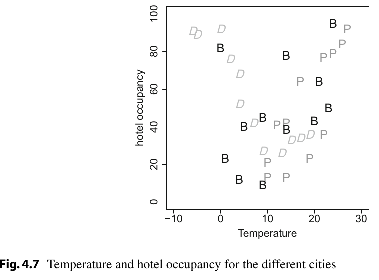
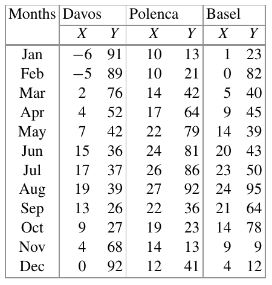
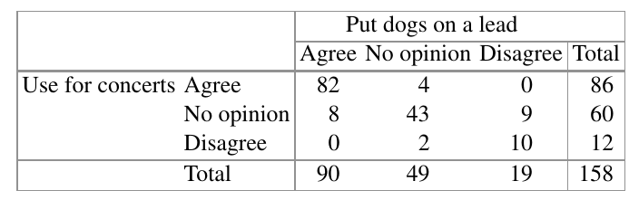

```{r setup, include=FALSE}
knitr::opts_chunk$set(echo = TRUE)
library(knitr)
library(dplyr)
library(reticulate)
reticulate::use_condaenv("py38")
```

## Exercise 4.1 
A newspaper asks two of its staff to review the coffee quality at different trendy cafés. The coffee can be rated on a scale from 1 (miserable) to 10 (excellent). The results of the two coffee enthusiasts X and Y are as follows:

Café i | xi | yi
--- |--- |---
1 | 3 | 6
2 | 8 | 7
3 | 7 | 10
4 | 9 | 8
5 | 5 | 4

### a. Calculate and interpret Spearman’s rank correlation coefficient.
```{r}
# r
data_exercise41 <- data.frame(cafe = 1:5, x = c(3, 8, 7, 9, 5), y = c(6, 7, 10, 8, 4))
cor(x = data_exercise41$x, y = data_exercise41$y, method = 'spearman')
```

```{python}
# python 
from scipy import stats
import pandas as pd
import numpy as np

data_exercise41 = pd.DataFrame({"cafe":np.arange(1, 6), "x":[3, 8, 7, 9, 5], "y":[6, 7, 10, 8,4]})
stats.spearmanr(data_exercise41[["x"]], data_exercise41[["y"]])
```
Both of the participant's rates seem to have a moderate ascendent tendency. It means that both of them think that the coffee have a good quality

### b. Does Spearman’s R differ depending on whether ranks are assigned in a decreasing or increasing order?
No, it don't. It does not matter wheter we choose an ascending or descending order of the ranks, the value remains the same 

### c. Suppose the coffee can only be rated as either good ($>5$) or bad ($\leq5$). Do the chances of a good rating differ between the two journalists?

```{r}
# r 
data_exercise41[, 2:3] <- ifelse(data_exercise41[, 2:3] > 5, "Good", "Bad")
data_exercise41 <- data.frame("quality" = c(data_exercise41$x, data_exercise41$y), 
                                              "enthusiast" = c(rep("x", 5), rep("y", 5)))
identity_m41 <- table(data_exercise41$quality, data_exercise41$enthusiast)
identity_m41
(identity_m41[1, 1]*identity_m41[2, 2]) / (identity_m41[1, 2]*identity_m41[2, 1])
```


```{r include=FALSE}
rm(data_exercise41)
rm(identity_m41)
```

```{python}
# python
data_exercise41['x'] = data_exercise41['x'].apply(lambda x: 1 if x > 5 else 0)
data_exercise41['y'] = data_exercise41['y'].apply(lambda x: 1 if x > 5 else 0)

contingency_data = pd.DataFrame({"quality": np.concatenate((data_exercise41['x'], data_exercise41['y'])), "enthusiast":np.concatenate((np.repeat("x", 5), np.repeat("y", 5)))})

contingency_data = pd.crosstab(contingency_data['quality'], contingency_data['enthusiast'], margins = False)
contingency_data

(contingency_data.iloc[0, 0] * contingency_data.iloc[1, 1])/(contingency_data.iloc[0, 1] * contingency_data.iloc[1, 0])
```
```{python include=FALSE}
del data_exercise41
del contingency_data
```

That means that the chance of rating a coffee as good is twice as likely for person X compared to person Y


## Exercise 4.2 

A total of 150 customers of a petrol station are asked about their satisfaction with their car and motorbike insurance. The results are summarized below:

. | Satisfied | Unsatisfied | Total
--- | --- | --- | ---
Car | 33 | 25 | 58
Car (diesel engine) | 29 | 31 | 60
Motorbike | 12 | 20 | 32
Total | 74 | 76 | 150


### a. Determine and interpret Pearson’s $\chi^2$ statistic, Cramer’s $V$ , and $C_{corr}$.
```{r}
# r
data_exercise42 <- data.frame(Satisfied = c(33, 29, 12), Unsatisfied = c(25, 31, 20), 
                              row.names =  c("Car", "Car (diesel engine)", "Motorbike"))

# ----- chi squared 
chisq.test(data_exercise42)$expected
chisq_test_42 <- chisq.test(data_exercise42)$statistic
chisq_test_42


# ---- Cramers V
sqrt((chisq_test_42/150*(2-1)))

# ---- Contingency Coefficient C
sqrt((2)/(2-1))*sqrt((chisq_test_42)/(chisq_test_42 + 150))
```

```{python}
# python
data_exercise42 = pd.DataFrame({"Satisfied": [33, 29, 12], "Unsatisfied": [25, 31, 20]}, 
                    index = ["Car", "Car (diesel engine)", "Motorbike"])

# ---- Chi squared 
xsquare, pvalue, degreeF, expected = stats.chi2_contingency(data_exercise42)
xsquare

# ---- Cramers V
np.sqrt(xsquare/150*(2-1))

# ----- Contingency Coefficient C
np.sqrt((2)/(2-1))*np.sqrt((xsquare/(xsquare + 150)))
```
### b. Combine the categories “car” and “car (diesel engine)” and produce the corresponding 2 × 2 table. Calculate χ2 as efficiently as possible and give a meaningful interpretation of the odds ratio.
```{r}
# -------------------- r---------------------------
data_exercise42 <- rbind(data_exercise42[-c(1,2), ], data_exercise42[1, ] + data_exercise42[2, ])
data_exercise42 <- data_exercise42[2:1, ]

chisq.test(data_exercise42)$expected
chisq.test(data_exercise42)$statistic


(data_exercise42[1, 1]*data_exercise42[2, 2]) / (data_exercise42[1, 2]*data_exercise42[2, 1])
```

```{python}
# -------------------- python ---------------------------
data_exercise42= data_exercise42.append(data_exercise42.loc[["Car", "Car (diesel engine)"]].sum(axis = 0), 
                                                ignore_index = True).iloc[[3, 2]]
data_exercise42.rename(index = {3:"Car", 2:"Motorbike"})

xsquare, pvalue, degreeF, expected = stats.chi2_contingency(data_exercise42)
xsquare


(data_exercise42.iloc[0, 0] * data_exercise42.iloc[1, 1])/(data_exercise42.iloc[0, 1] * data_exercise42.iloc[1, 0])
```
```{python include=FALSE}
del data_exercise42
del xsquare, pvalue, degreeF, expected 
```


The chances of be satisfied are 1.84 times higher for individuals with car compared with individual with motorbike 

### c. Compare the results from (a) and (b).

In both of the results, the association between the two variables is weak. Although, when we combined the categories "Car" and "Car (diesel engine)" the association was lower. The odds ratio give us a clear interpretation, but we should determinate if this is trustworthy 

```{r include=FALSE}
rm(data_exercise42)
```

## Exercise 4.3 

There has been a big debate about the usefulness of speed limits on public roads. Consider the following table which lists the speed limits for country roads (in miles/h) and traffic deaths (per 100 million km) for different countries in 1986 when the debate was particularly serious:


Country | Speed limit | Traffic deaths
--- | --- | ---
Denmark | 55 | 4.1
Japan | 55 | 4.7
Canada | 60 | 4.3
Netherlands | 60 | 5.1
Italy | 75 | 6.1


#### a. Draw the scatter plot for the two variables.
```{r}
# --------------------- r --------------------------------
data_exercise43 <- data.frame(country = c("Denmark", "Japan", "Canada", "Netherlands", "Italy"),
                              speed_limit = c(55, 55, 60, 60, 75),
                              traffic_deaths = c(4.1, 4.7, 4.3, 5.1, 6.1))

plot(data_exercise43$speed_limit, data_exercise43$traffic_deaths, pch= 19)
```
```{python}
# --------------------- python --------------------------------
import matplotlib.pyplot as plt

data_exercise43 = pd.DataFrame({"country": ["Denmark", "Japan", "Canada", "Netherlands", "Italy"],
                                "speed_limit": [55, 55, 60, 60, 75],
                                "traffic_deaths": [4.1, 4.7, 4.3, 5.1, 6.1]})
                                
plt.plot(data_exercise43["speed_limit"], data_exercise43["traffic_deaths"])
plt.show()
```


#### b. Calculate the Bravais–Pearson and Spearman correlation coefficients.
```{r}
# --------------------- r --------------------------------
# Bravais-Pearson Correlation coefficient 
cor(data_exercise43$speed_limit, data_exercise43$traffic_deaths, method = 'pearson')

# Spearman correlation coefficients 
cor(data_exercise43$speed_limit, data_exercise43$traffic_deaths, method = 'spearman')
```

```{python}
# --------------------- python --------------------------------
# Bravais-Pearson Correlation coefficient 
stats.pearsonr(data_exercise43["speed_limit"], data_exercise43["traffic_deaths"])

# Spearman correlation coefficients 
stats.spearmanr(data_exercise43["speed_limit"], data_exercise43["traffic_deaths"])
```


#### c. What are the effects on the correlation coefficients if the speed limit is given in km/h rather than miles/h (1 mile/h $\approx$ 1.61 km/h)?

The results stay the same. These correlation coefficients are invariant from the units 


#### d. Consider one more observation: the speed limit for England was 70 miles/h and the death rate was 3.1.

(i) Add this observation to the scatter plot.

```{r}
# --------------------- r --------------------------------
data_exercise43 <- data_exercise43 <- rbind(data_exercise43, list("England", 70, 3.1))

plot(data_exercise43$speed_limit, data_exercise43$traffic_deaths, pch= 19)
```

```{python}
# --------------------- python --------------------------------
data_exercise43.loc[5] = ["England", 70, 3.1]

plt.scatter(data_exercise43["speed_limit"], data_exercise43["traffic_deaths"])
plt.show()
```

(ii) Calculate the Bravais–Pearson correlation coefficient given this additional observation.

```{r}
# --------------------- r --------------------------------
# Bravais-Pearson Correlation coefficient 
cor(data_exercise43$speed_limit, data_exercise43$traffic_deaths, method = 'pearson')
```

```{r include=FALSE}
rm(data_exercise43)
```

```{python}
# --------------------- python --------------------------------
# Bravais-Pearson Correlation coefficient 
stats.pearsonr(data_exercise43["speed_limit"], data_exercise43["traffic_deaths"])
```

```{python include=FALSE}
del data_exercise43
```


When we added the last point to the dataframe, this modifies the linear relation between the two variables due to that value is low. 

## Exercise 4.4 

The famous passenger liner Titanic hit an iceberg in 1912 and sank. A total of 337 passengers travelled in first class, 285 in second class, and 721 in third class. In addition, there were 885 staff members on board. Not all passengers could be rescued. Only the following were rescued: 135 from the first class, 160 from the second class, 541 from the third class and 674 staff.

#### a. Determine and interpret the contingency table for the variables “travel class” and “rescue status”.
```{r}
# --------------------- r --------------------------------
data_exercise44 <- data.frame(first_class = c(135, 202, 337), second_class = c(160, 125, 285), 
                              third_class = c(541, 180, 721), staff = c(674, 211, 885),
                              total = c(1510, 718, 2228), 
                              row.names = c("Rescued", "NotRescued", "Total"))

kable(data_exercise44)
```

```{python}
# --------------------- python --------------------------------
data_exercise44 = pd.DataFrame({"first_class": [135, 202, 337], 
                                "second_class": [160, 125, 285],
                                "third_class": [541, 180, 721],
                                "staff": [674, 211, 885],
                                "Total": [1510, 718, 2228]},
                                index = ["Rescued", "NotRescued", "Total"])
data_exercise44
```


#### b. Use a contingency table to summarize the conditional relative frequency distributions of rescue status given travel class. Could there be an association of the two variables?

```{r}
# --------------------- r --------------------------------
rela_freq_dist <- apply(data_exercise44[1:2, c(1, 2, 3, 4)], 1, function(xi, y){
    xi / y
}, y = data_exercise44[3, c(1, 2, 3, 4)])
rela_freq_dist <- rbind(rescued = rela_freq_dist$Rescued, not_resquet = rela_freq_dist$NotRescued)
kable(rela_freq_dist)
```

```{python}
# --------------------- python --------------------------------
data_exercise44.iloc[0:2, 0:4] / data_exercise44.iloc[2, 0:4]
```

If we determine the conditional frequency distribution of the rescue status given the travel class, we could see that there were fewer individuals rescued in the first classes. It could be due to the numbers of passengers in each class, for example, there were more individuals in the staff than in the first class. 

#### c. What would the contingency table from (a) look like under the independence assumption? Calculate Cramer’s V statistic. Is there any association between travel class and rescue status?
```{r}
# ----- Expected values under independence 
chisq.test(data_exercise44[1:2, 1:4])$expected

# -------- Cramer Statistic -------
chisq_test_44 <- chisq.test(data_exercise44[1:2, 1:4])$statistic

sqrt((chisq_test_44/2228*(2-1)))
```
```{python}
# --------------------- python --------------------------------
xsquare, pvalue, degreeF, expected = stats.chi2_contingency(data_exercise44.iloc[0:2, 0:4])

# ----- Expected values under independence 
expected

# -------- Cramer Statistic -------
np.sqrt(xsquare/2228*(2-1))
```

If we consider the Cramer's V statistic, there are a wear relation between the travel class and rescue status 


#### d. Combine the categories “first class” and “second class” as well as “third class” and “staff”. Create a contingency table based on these new categories. Determine and interpret Cramer’s V , the odds ratio, and relative risks of your choice.
```{r}
# -------------------- r---------------------------
data_exercise44 <- cbind(first_second = data_exercise44[1:2, 1] + data_exercise44[1:2, 2], 
                         third_staff = data_exercise44[1:2, 3] + data_exercise44[1:2, 4])
row.names(data_exercise44) <- c("Rescued", "NotRescued")

kable(data_exercise44)

# ----- Cramer's V statistic
chisq.test(data_exercise44)$expected
chisq_test_44 <- chisq.test(data_exercise44)$statistic

sqrt((chisq_test_44/2228*(2-1)))

# ------- Odds ratio -------
(data_exercise44[1, 1]*data_exercise44[2, 2]) / (data_exercise44[1, 2]*data_exercise44[2, 1])

# Relative risk of Rescued given the travel class
(data_exercise44[1, 1]/(data_exercise44[1, 1] + data_exercise44[2, 1])) / 
    (data_exercise44[1, 2]/(data_exercise44[1, 2] + data_exercise44[2, 2]))
```

```{r include=FALSE}
rm(data_exercise44)
rm(rela_freq_dist)
```

```{python}
# --------------------- python --------------------------------
data_exercise44["first_second"] = data_exercise44.iloc[0:3, 0:2].sum(axis = 1)
data_exercise44["third_staff"] = data_exercise44.iloc[0:3, 2:4].sum(axis = 1)

data_exercise44 = data_exercise44.iloc[0:2, 5:7]

# ----- Cramer's V statistic
xsquare, pvalue, degreeF, expected = stats.chi2_contingency(data_exercise44.iloc[0:2, 0:2])
np.sqrt(xsquare/2228*(2-1))

# ------- Odds ratio -------
(data_exercise44.iloc[0, 0] * data_exercise44.iloc[1, 1])/(data_exercise44.iloc[0, 1] * data_exercise44.iloc[1, 0])
```


```{python include=FALSE}
del data_exercise44
del xsquare, pvalue, degreeF, expected
```


#### e. Given the results from (a) to (d), what are your conclusions? 

Even when we merged the categories the weak relation remains. In none of the the correlation coefficients the data demonstrated a correlation between the variables. 
If we focus in the relative risk, each category is similar. 

## Exercise 4.5 

To study the association of the monthly average temperature (in °C, X) and hotel occupation (in $\%$, Y), we consider data from three cities: Polenca (Mallorca, Spain) as a summer holiday destination, Davos (Switzerland) as a winter skiing destination, and Basel (Switzerland) as a business destination





a. Calculate the Bravais–Pearson correlation coefficient. The following summary statistics are available: $\sum_{i=1}^{36}x_iy_i = 22$, $\bar{x} = 12.22$, $\bar{y} = 51.28$, $\tilde{s}_x^2 = 76.95$ and $\tilde{s}_y^2 = 706.98$
```{r}
Sxy <- 22776 - 36*(12.22*51.28)
Sxx <- 76.95*36
Syy <- 706.98*36
Sxy/sqrt(Sxx*Syy)
```

If we consider this correlation coefficient, we could say that there is not a relation between both variables 

b. Interpret the scatter plot in Fig. 4.7 which visualizes temperature and hotel occupancy for Davos (D), Polenca (P), and Basel (B).
There is not a tendency from all the data together. But if we see the values of each category, we could see a weak tendency in each one of them. 

c. Use R to calculate the correlation coefficient separately for each city. Interpret the results and discuss the use of the correlation coefficient if more than two variables are available.

```{r}
# --------------------- r --------------------------------
data_exercise45 <- data.frame(Months = rep(c("Jan", "Feb", "Mar", 
                                                "Apr", "May", "Jun", "Jul", "Aug", 
                                                "Sep", "Oct", "Nov", "Dec"), 3),
                              X = c(-6, -5, 2, 4, 7, 15, 17, 19, 13, 9, 4, 0, 10, 10, 
                                    14, 17, 22, 24, 26, 27, 22, 19, 14, 12, 1, 0, 
                                    5, 9, 14, 20, 23, 24, 21, 14, 9, 4),
                              Y = c(91, 89, 76, 52, 42, 36, 37, 39, 26, 27, 68, 92, 
                                    13, 21, 42, 64, 79, 81, 86, 92, 36, 23, 12, 41, 
                                    23, 82, 40, 45, 39, 43, 50, 95, 64, 78, 9, 12), 
                              City = c(rep("Davos", 12), rep("Polenca", 12), rep("Basel", 12)))


data_exercise45 %>% group_by(City) %>% summarize(cor(X, Y, method = "pearson"))
```
```{python}
# --------------------- python --------------------------------
data_exercise45 = pd.DataFrame({"Months": np.repeat([["Jan", "Feb", "Mar", 
                                                "Apr", "May", "Jun", "Jul", "Aug", 
                                                "Sep", "Oct", "Nov", "Dec"]], 3, 0).reshape((36, )), 
                                "X":[-6, -5, 2, 4, 7, 15, 17, 19, 13, 9, 4, 0, 10, 10, 
                                    14, 17, 22, 24, 26, 27, 22, 19, 14, 12, 1, 0, 
                                    5, 9, 14, 20, 23, 24, 21, 14, 9, 4],
                                "Y": [91, 89, 76, 52, 42, 36, 37, 39, 26, 27, 68, 92, 
                                    13, 21, 42, 64, 79, 81, 86, 92, 36, 23, 12, 41, 
                                    23, 82, 40, 45, 39, 43, 50, 95, 64, 78, 9, 12],
                                "City": np.repeat(["Davos", "Polenca", "Basel"], 12)})
```

```{python}
data_exercise45.pipe(lambda x: x.groupby("City")).apply(lambda x: (stats.pearsonr(x.X, x.Y)))
```


```{r include=FALSE}
rm(data_exercise45)
```

```{python include=FALSE}
del data_exercise45
```
In the Spearman correlation coefficient for each group we can see a pattern in the Davos and Polenca cities. In the first one, has a negative tendency and in the next one has a positive tendency. On the other hand, the city Basel seems do not have a linear correlation. 
In general, when we apply measures of correlation on a group, that have a particular tendency each one of them, the correlation coefficient will not be representative. 

## Exercise 4.6 

Consider a neighbourhood survey on the use of a local park. Respondents were asked whether the park may be used for summer music concerts and whether dog owners should put their dogs on a lead. The results are summarized in the following contingency table:



```{r}
# --------------------- r --------------------------------
data_exercise46 <- data.frame(dog_agree = c(82, 8, 0, 90), dog_no_opinion = c(4, 43, 2, 49), 
                              dog_disagre = c(0, 9, 10, 19), dog_total = c(86, 60, 12, 158), 
                              row.names = c("con_agree", "con_no_opinion", "con_disagree", "con_total"))
```

```{python}
# --------------------- python --------------------------------
data_exercise46 = pd.DataFrame({"dog_agree": [82, 8, 0, 90], "dog_no_opinion":[4, 43, 2, 49],
                                "dog_disagree": [0, 9, 10, 19], "dog_total":[86, 60, 12, 158]},
                                index = ["con_agree", "con_no_opinion", "con_disagree", "con_total"])
```


#### a) Calculate and interpret Goodman and Kruskal’s $\gamma$.
```{r}
library(ryouready)
ord.gamma(as.matrix(data_exercise46[1:3, 1:3]))
```


#### b) Create the contingency table which is obtained when the categories “no opinion” and “agree” are combined.
```{r}
# --------------------- r --------------------------------
data_exercise46 <- rbind(data_exercise46[-c(1,2), ], con_agree_onot = data_exercise46[1, ] + data_exercise46[2, ])
data_exercise46 <- cbind(data_exercise46[, c(3, 4)], dog_agree_onot = data_exercise46[, 1] + data_exercise46[, 2])

data_exercise46 <- data_exercise46[c(3, 1, 2), c(3, 1, 2)]
```

```{python}
# --------------------- python --------------------------------
data_exercise46 =  data_exercise46.append(data_exercise46.iloc[0:2, 0:4].sum(axis = 0), 
                                            ignore_index = True).iloc[[4, 2, 3]]
data_exercise46["dog_agree_onot"] = data_exercise46.iloc[0:3, 0:2].sum(axis = 1)

data_exercise46 = data_exercise46.iloc[:, [4, 2, 3]]
data_exercise46.rename(index = {4: "con_agree_onot", 2:"con_disagree", 3:"con_total"})
```

#### c) What is the relative risk of disagreement with summer concerts depending on the opinion about using leads?
```{r}
(data_exercise46[2, 1]/data_exercise46[3, 1])/(data_exercise46[2, 2]/data_exercise46[3, 2])
```
People who disagree with using the park for concerns are 0.03 times lower in the group of people who agree with the dogs owners should put their dogs on a lead than who disagree. 

#### d) Calculate the odds ratio and offer two interpretations of it.
```{r}
(data_exercise46[1, 1]*data_exercise46[2, 2]) / (data_exercise46[1, 2]*data_exercise46[2, 1])
```
The chances of not disagreeing with using the park for concerns is 76 times higher for those who do not disagree with that the dogs owners should put their dogs on a lead. 


#### e) Determine $\gamma$ for the table calculated in (c).
```{r}
library(ryouready)
ord.gamma(as.matrix(data_exercise46[1:2, 1:2]))
```

#### f) What is your final interpretation and what may be the best measure to use in this example?
With the help of the Goodman and Kruskal’s $\gamma$, we could say that the agreement with both questions is strongly related, due to the value is high. Measures like the relative risks and odds ratios give us an interpretation easier to understand but we can not plenty rely on them. 


```{r include=FALSE}
rm(data_exercise46)
```

```{python include=FALSE}
del data_exercise46
```

## Exercise 4.7 

Make yourself familiar with the Olympic decathlon data described in Appendix A.4. Read in and attach the data in R.
```{r}
data_exercise47 <- read.csv("../../Data/decathlon.csv", row.names = 1)
summary(data_exercise47)
head(data_exercise47, 5)
str(data_exercise47)
```

```{python}
data_exercise47 = pd.read_csv("../../Data/decathlon.csv", encoding= 'unicode_escape', index_col = 0)
data_exercise47.head()
data_exercise47.info()
data_exercise47.describe()
```


a. Use R to calculate and interpret the Bravais–Pearson correlation coefficient between the results of the discus and the shot-put events.
```{r}
# --------------------- r --------------------------------
good <- complete.cases(data_exercise47)
data_exercise47 <- data_exercise47[good, ]
cor(data_exercise47$X.Discus, data_exercise47$X.Shot.put, method = 'pearson')
```

```{python}
# --------------------- python -------------------------------
data_exercise47 = data_exercise47.dropna(axis=0)
stats.pearsonr(data_exercise47["X.Discus"], data_exercise47["X.Shot.put"])
```
There is a moderate relation between the variables. 

b. There are 10 continuous variables. How many different correlation coefficients can you calculate? How would you summarize them?
If we consider that the correlation coefficient considers two variables, there are 45 possible measurements. 
To show the correlation of each pair, we could make a correlation matrix: 
```{r}
# --------------------- r --------------------------------
corr <- cor(data_exercise47, method = 'pearson')
corr
```
```{python}
# --------------------- python --------------------------------
corr = stats.spearmanr(data_exercise47)
corr
```

```{r include=FALSE}
rm(data_exercise47)
```

```{python include=FALSE}
del data_exercise47
```

## Exercise 4.8 

We are interested in the pizza delivery data which is described in Appendix A.4.
```{r}
# --------------------- r --------------------------------
data_exercise48 <- read.csv("../../Data/pizza_delivery.csv")
summary(data_exercise48)
head(data_exercise48, 5)
str(data_exercise48)
```

```{python}
# --------------------- python --------------------------------
data_exercise48 = pd.read_csv("../../Data/pizza_delivery.csv", encoding= 'unicode_escape')
data_exercise48.head()
data_exercise48.info()
data_exercise48.describe()
```

a. Read in the data and create two new binary variables which describe whether a pizza was hot ($>$ 65 °C) and the delivery time was short ($<$ 30 min). Create a contingency table for the two new variables.
```{r}
# --------------------- r --------------------------------
data_exercise48 <-  data_exercise48 %>% 
                        mutate(temp_bin = ifelse(data_exercise48$temperature > 65, 
                                                 "Hot", "NotHot"), 
                               time_bin = ifelse(data_exercise48$time < 30, "Less30", "More30"))

contingency <- table(data_exercise48$temp_bin, data_exercise48$time_bin)
contingency
```

```{python}
# --------------------- python --------------------------------
data_exercise48["temp_bin"] = data_exercise48["temperature"].apply(lambda x: "Hot" if x > 65 else "NotHot")
data_exercise48["time_bin"] = data_exercise48["time"].apply(lambda x: "Less30" if x < 30 else "More30")

contingency = pd.crosstab(data_exercise48["temp_bin"], data_exercise48["time_bin"], margins = False)
contingency 
```


b. Calculate and interpret the odds ratio for the contingency table from (a).
```{r}
# --------------------- r --------------------------------
(contingency[1, 1]*contingency[2, 2]) / (contingency[1, 2]*contingency[2, 1])
```
The chances to have a cold pizza is 5 times higher if the delivery time is high

c. Use Cramer’s $V$ , Stuart’s $\tau_c$ , Goodman and Kruskal’s $\gamma$, and a stacked bar chart to explore the association between the categorical time and temperature variables.
```{r}
# ----- cramers V -----
chisq <- chisq.test(contingency)$statistic

sqrt((chisq/1266*(2-1)))

# ---- stuart tau -----
library(ryouready)
ord.tau(contingency)

# ---- Goodman gamma -----
ord.gamma(contingency)
```
This show that the variable have a moderate-to-weak relation between them. 


d. Draw a scatter plot for the continuous time and temperature variables. Determine both the Bravais–Pearson and Spearman correlation coefficients.
```{r}
# ------ Brabais-Pearson -----
cor(data_exercise48$temperature, data_exercise48$time, method = 'pearson')

# ------- Spearman ---------
cor(data_exercise48$temperature, data_exercise48$time, method = 'spearman')

plot(data_exercise48$temperature, data_exercise48$time, pch = 19)
```
In general, the data show a weak negative tendency, it means, if is high the delivery time so the temperature tends to be low. 


e. Use methods of your choice to explore the relationship between temperature and driver, operator, number of ordered pizzas and bill. Is it clear which of the variables influence the pizza temperature?
```{r}
boxplot(data_exercise48$temperature~data_exercise48$drive)
boxplot(data_exercise48$temperature~data_exercise48$operator)
plot(data_exercise48$temperature, data_exercise48$pizzas)
cor(data_exercise48$temperature, data_exercise48$pizzas, method = "pearson")

plot(data_exercise48$temperature, data_exercise48$bill)
cor(data_exercise48$temperature, data_exercise48$bill, method = "pearson")
```


