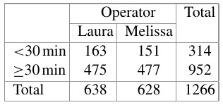

```{r setup, include=FALSE}
knitr::opts_chunk$set(echo = TRUE)
```

## Exercise 9.1 

Consider an i.i.d. sample of size $n$ from a $Po(\lambda)$ distributed random variable $X$.

a. Determine the maximum likelihood estimate for $\lambda$.
b. What does the log-likelihood function look like for the following realizations: $x_1 = 4, x_2 = 3, x_3 = 8, x_4 = 6, x_5 = 6$? Plot the function using R. Hint: The curve command can be used to plot functions.
c. Use the Neyman–Fisher Factorization Theorem to argue that the maximum like-lihood estimate obtained in (a) is a sufficient statistic for $\lambda$.


## Exercise 9.2
Consider an i.i.d. sample of size $n$ from a $N (\mu, \sigma^2 )$ distributed random variable $X$. 
a. Determine the maximum likelihood estimator for $\mu$ under the assumption that $\sigma^2 = 1$.
b. Now determine the maximum likelihood estimator for $\mu$ for an arbitrary $\sigma^2$.
c. What is the maximum likelihood estimate for $\sigma^2$?


## Exercise 9.3 

Let $X_1 , X_2 , . . . , X_n$ be $n$ i.i.d. random variables which follow a uniform distribution, $U(0, \theta)$. Write down the likelihood function and argue, without differentiating the function, what the maximum likelihood estimate of $\theta$ is.


## Exercise 9.4 

Let $X_1 , X_2 , . . . , X_n$ be $n$ i.i.d. random variables which follow an exponential distribution. An intelligent statistician proposes to use the following two estimators to estimate $\mu = 1/\lambda$:
i. $T_n(X)=nX_{min}$ with $X_{min}=min(X_1,...,X_n)$ and $X_{min}\sim Exp(n\lambda)$
ii. $V_n(X)=n^{-1}\sum\limits_{i=1}^nX_i$

a. Are both $T_n(X)$ and $V_n(X)$ (asymptotically) unbiased for $\mu$?
b. Calculate the mean squared error of both estimators. Which estimator is more efficient?
c. Is $V_n(X)$ MSE consistent, weakly consistent, both, or not consistent at all?

## Exercise 9.5 

A national park in Namibia determines the weight (in $kg$) of a sample of common eland antelopes:
450 730 700 600 620 660 850 520 490 670 700 820
910 770 760 620 550 520 590 490 620 660 940 790
Calculate
a. the point estimate of $\mu$ and $\sigma^2$ and
b. the confidence interval for $\mu (\alpha = 0.05)$ under the assumption that the weight is normally distributed.
c. Use R to reproduce the results from (b).

## Exercise 9.6 

We are interested in the heights of the players of the two basketball teams “Brose Baskets Bamberg” and “Bayer Giants Leverkusen” as well as the football team “SV Werder Bremen”. The following summary statistics are given:

. | N | Minimum | Maximum | Mean | Std. dev
--- | --- | --- | --- | --- | ---
Bamberg | 16 | 185 | 211 | 199.06 | 7.047
Leverkusen | 14 | 175 | 210 | 196.00 | 9.782
Bremen | 23 | 178 | 195 | 187.52 | 5.239

Calculate a $95\%$ confidence interval for $\mu$ for all three teams and interpret the results

## Exercise 9.7 

A married couple tosses a coin after each dinner to determine who has to wash the dishes. If the coin shows “head”, then the husband has to wash the dishes, and if the coin shows “tails”, then the wife has to wash the dishes. After $98$ dinners, the wife notes that the coin has shown head $59$ times.

a. Estimate the probability that the wife has to wash the dishes.
b. Calculate and interpret the $95\%$ confidence interval for $p$.
c. How many dinners are needed to estimate the true probability for the coin showing “head” with a precision of $\pm 0.5 \%$ under the assumption that the coin is fair?

## Exercise 9.8 

Suppose $93$ out of $104$ pupils have passed the final examination at a certain school.

(a) Calculate a $95\%$ confidence interval for the probability of failing the examination both by manual calculations and by using R, and compare the results.
(b) At county level $3.2\%$ of pupils failed the examination. Are the school’s pupils worse than those in the whole county?

## Exercise 9.9 

To estimate the audience rate for several TV stations, $3000$ households are asked to allow a device, which records which TV station is watched, to be installed on their TVs. $2500$ agreed to participate. Assume it is of interest to estimate the probability of someone switching on the TV and watching the show “Germany’s next top model”.
a. What is the precision with which the probability can be estimated?
b. What source of bias could potentially influence the estimates?

## Exercise 9.10 

An Olympic decathlon athlete is interested in his performance compared with the performance of other athletes. He is a good runner and interested in his $100$ m results compared with those of other athletes.

a. He uses the decathlon data from this book (Appendix A.2) to come up with $\hat{\sigma} = s = 0.233$. What sample size does he need to calculate a $95\%$ confidence interval for the mean running time which is precise to $\pm0.1$ s?
b. Calculate a $95\%$ confidence interval for the mean running time ($\bar{x} = 10.93$) of the $30$ athletes captured in the data set in Chap. A.2. Interpret the width of this interval compared with the width determined in a).
c. The runner’s own best time is $10.86$s. He wants to be among the best $10\%$ of all athletes. Calculate an appropriate confidence interval to compare his time with the $10\%$ best times.

## Exercise 9.11 

Consider the pizza delivery data described in Chap. A.4. We distinguish between pizzas delivered on time (i.e. in less than $30$ min) and not delivered on time (i.e. in more than $30$ min). The contingency table for delivery time and operator looks as follows:



a. Calculate and interpret the odds ratio and its $95\%$ confidence interval
b. Reproduce the results from (a) using R

